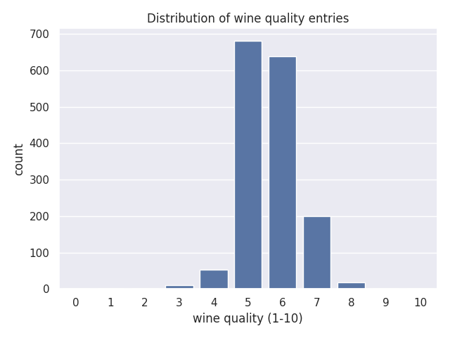

# linear-regression

## Description/Overview

In this project I implement different methods of linear regression by hand without the usage of libraries such as keras os scikit-learn. So far I have implemented batch gradient descent and mini batch gradient descent. For each of these gradient descent methods I have also implemented an optimized version using linear algebra with numpy.

The wine quality data set used comes from the UCI Machine Learning Repository. A total of 11 column are included and in my project I use 10 features to predict the wine quality (rated 1-10) 

## Overview of the data

### correlations


The highest correlation with alcohol quality we see is between alcohol percentage.


After further examination it is apparent that there is a high correlation between the two as seen through the small p value.
Before training and testing an algorithm it is important take a closer look at the distribution of quality values in the data.



Looking at the table it is clear that there are apparent biases in the data. x-percent of the data at qualities 5 and 6 and there are no possible 

## Training and Testing

In order to test the effectivness of each algorithm, training and testing were each randomly split with a 75% of rows for training. Results were checked using mean squared error.

All of the results are plotted with matplot lib and seaborn.

### Batch Gradient Descent (unoptimized)


    
#### Analysis
The loss for each epoch gets consistantly lower each time with a negative acceleration. This is
batch gradient descent calculates the rate of change of all features given by using every row in the data set. By using every row the algorithm mathmatically garuentees that the loss will decrease each epoch.

pros
* Garuenteed minimization of the cost
* Predictable

cons
* Very slow - It took 31 whole seconds to run this algorithm

### Mini-batch Gradient Descent (unoptimized)


#### Analysis
The loss for each epoch decreases on average. Unlike batch gradient descent, mini-batch gradient descent cannot gaurentee a decrease for each epoch. This is because of the random nature of
mini-batch gradient descent which samples a portion of the training data for testing. That is why the loss eventually converges to an answer but there is a some fuzz in the direction it takes.

pros
* much faster (a tenth of the time of batch gradient descent)
* often times less prone to overfitting (although in this cause the cost was worse).

cons
* results can be more unpredictable

### Batch Gradient Descent (optimized)

%20Batch%20Gradient%20Descent.png)

#### Analysis
The algorithm results look identical to the unoptimized batch gradient descent with the exception of the much faster time.

pros
* way faster even when training on the whole data set

### Mini Batch Gradient Descent (optimized)

%20Mini-batch%20Gradient%20Descent.png)

#### Analysis
The algorithm results look identical to its unoptimized counterpart with the exception of the much faster time.

pros
* very fast

## Summary of findings

From here we can further minimize the cost of regression by doing the following:
* mini batch gradient descent
* having 1000 epoches
* removing low correlating columns: pH, residual sugar, fixed acidity
* z score standardization
* 3 fold cross validation

.png)

At around epoch number 600 the losses start to converge and the final cost achieved is around .5 to .6 in only .06 seconds. This time is very fast considering 10x more echoches were used.

### Citations
```
Cortez, P., Cerdeira, A., Almeida, F., Matos, T., & Reis, J. (2009).
Wine Quality [Dataset]. UCI Machine Learning Repository.
https://doi.org/10.24432/C56S3T.
```

## TODO
* implement cross validation algorithm
* implement a matrix decomposition algorithm to solve a linear regression